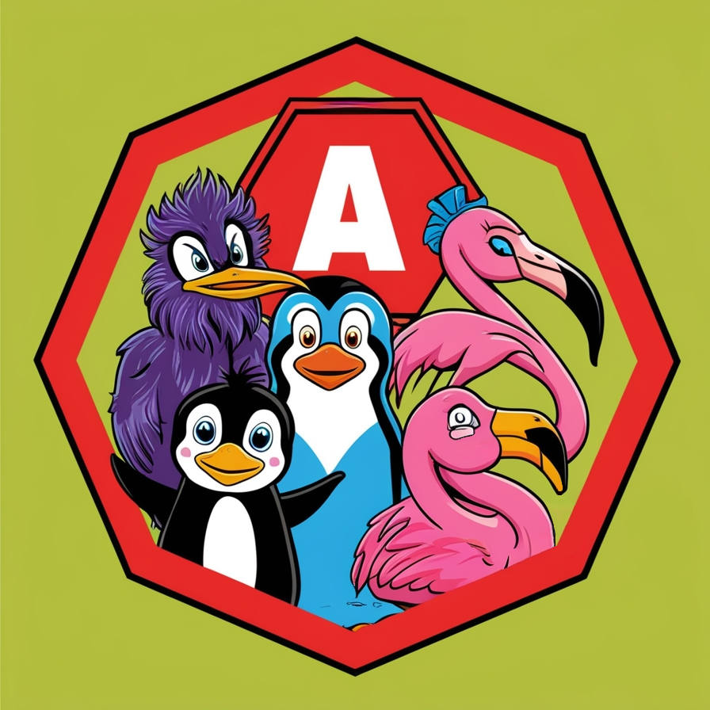

> Matthew 5
>
> [43] Ye have heard that it hath been said, Thou shalt love thy neighbour, and hate thine enemy. [44] But I say unto you, Love your enemies, bless them that curse you, do good to them that hate you, and pray for them which despitefully use you, and persecute you; [45] that ye may be the children of your Father which is in heaven: **for he maketh his sun to rise on the evil and on the good, and sendeth rain on the just and on the unjust.**

# Parody Api
If you code using this lib you [automatically become a cypherpunk](https://cdn.nakamotoinstitute.org/docs/cypherpunk-manifesto.txt).

**Not released yet**

## Features of each parody project


## Parody Projects
Parody projects are jokes in the form of fully functional clients nostr.

 - [Omeglestr](https://github.com/antonioconselheiro/omeglestr) was the last joke told, you can access [this here](https://antonioconselheiro.github.io/omeglestr/#/chat).
 - [Twitter ᴾᵃʳᵒᵈʸ](https://github.com/antonioconselheiro/twitter-parody) it's a joke in progress.

I'm still going to tell a lot of jokes, all algorithms with nostr that allow these clients to perform their respective social network interactions will be centralized in this library.

Many will say that it is just a work of plagiarism and that there is no joke. If you do not understand humor and do not want to acquire a joke, do not interfere with my business.

## Release
Not released yet

## Warning
In release `1.x.x` this package will include `@belomonte/nostr-ngx` dependency, but `0.x.x` will be used while `@belomonte/nostr-ngx` is not released.
`@belomonte/nostr-ngx` will bring angular services to solve pool questions like relay routing, signing, cache for events and profile, deep kinds and interfaces and media uploading.

`@belomonte/nostr-ngx` will bring an extended version of NPool and it will read user configuration from his own storages structures, by using this package you must understand that means bring `@belomonte/nostr-ngx` basis archicture to your project, having `@belomonte/nostr-ngx` your project will be available to use `@belomonte/nostr-gui-ngx`, with some predefined components to allow user customize his configurations and other common screens that can be used in a nostr app.

The packages `@belomonte/nostr-ngx`, `@belomonte/nostr-gui-ngx` and `@belomonte/ngx-parody-api` are part of the same porpouse: bring to angular the classic social networks feature using nostr. At first, they will be just the reusable things from Twitter Parody, but there are plans to other parody projects and these classic social network features will be centralized in these libraries.

| Library | Release | Porpouse |
|-------------|-------------|-------------|
| @belomonte/nostr-ngx | Not released | Services to deal with nostr, it bring overridable taken decisions, allowing you override services to customize core behaviors  |
| @belomonte/nostr-gui-ngx | Not released | Read-to-use components to allow user set his configs, choose profile and signer, but also publish note, chat |
| @belomonte/ngx-parody-api | Not released | Classic social network features that require algorithms with a higher level of complexity to be established |

## Installing
`npm install @belomonte/ngx-parody-api --save`

`@nostrify/nostrify` is a dependecy from jsr registry, you may need add this dependecy like this:

`npx jsr add @nostrify/nostrify`

### Updating
`ng update` in angular cli 18 or lower [launches error](https://github.com/angular/angular-cli/issues/28834) when need update dependencies from registries different from npm either with .npmrc file in the project, so, if you need to update your project you may have to update this package "manually" by running this command again.

## How To Use
### Configure
The only available social network feature in this `@belomonte/ngx-parody-api` version is the `Talk to Stranger` feature from [Omeglestr](https://github.com/antonioconselheiro/omeglestr).

You must import TalkToStrangerModule and provide NPool configs, in the example below is created a single module just to provide these module and it's configs:

```typescript
import { CommonModule } from '@angular/common';
import { NgModule } from '@angular/core';
import { OmegleNPoolOpts } from './omegle.npool-opts';
import { POOL_OPTIONS_TOKEN, TalkToStrangerModule } from '@belomonte/ngx-parody-api';

@NgModule({
  imports: [
    CommonModule,
    TalkToStrangerModule
  ],
  providers: [
    {
      provide: POOL_OPTIONS_TOKEN,
      useClass: OmegleNPoolOpts
    }
  ],
  exports: [
    TalkToStrangerModule
  ]
})
export class OmegleModule { }
```

```typescript
@NgModule({
  declarations: [
    AppComponent
  ],
  imports: [
    BrowserModule,
    AppRoutingModule,

    // [...]
    OmegleModule
    // [...]
  ],
  bootstrap: [
    AppComponent
  ]
})
export class AppModule { }
```

In the example, the `OmegleNPoolOpts` service is the implementation of [NPoolOpts<?>](https://nostrify.dev/relay/pool#options) interface from `@nostrify/nostrify`, as you can [read in nostrify docs](https://nostrify.dev/relay/pool), this implementation is required to routing events to correct relay and to read from desired relay. `@belomonte/nostr-ngx` will bring an [overridable implementation](https://github.com/antonioconselheiro/nostr-ngx/blob/master/projects/nostr-ngx/src/lib/pool/relay-router.service.ts) for this, but here is an example of how it was implemented in `omeglestr`:

```typescript
@Injectable()
export class OmegleNPoolOpts implements NPoolOpts<NRelay1> {

  constructor(
    private relayConfigService: RelayConfigService
  ) { }
  
  open(url: string): NRelay1 {
    return new NRelay1(url);
  }

  async reqRouter(filters: NostrFilter[]): Promise<Map<string, NostrFilter[]>> {
    const toupleList: Array<[string, NostrFilter[]]> = [];
    this.relayConfigService
      .getConfig()
      .forEach(relay => toupleList.push([relay, filters]));

    return new Map(toupleList);
  }

  async eventRouter(): Promise<string[]> {
    return this.relayConfigService.getConfig();
  }
}
```

`RelayConfigService` is a custom service from `omeglestr` that read user choosen relay, you can copy this approuch from `omeglestr`, can set the relays hardcoded or can create a custom service.

### Find Stranger
After you configure your app relays, to find a stranger you must inject the service FindStrangerService as the example below:

```typescript
// [...]
export class ChatingComponent {

  //  by executing controller.abort() the search for stranger will
  //  be stopped, this can be used to allow user cancel search request
  controller = new AbortController();

  // [...]

  constructor(
    private findStrangerService: FindStrangerService
  ) { }

  // [...]

  onClickSearchStranger(): void {
    const stranger = await this.findStrangerService
      .searchStranger({
        signal: this.controller,
        searchTags: [ 'omegle' ], // will search for users with wannachat status indexed with #omegle
        userTags: [ 'omegle' ] // will include in your wannachat status a tag #omegle to index it to searching strangers
      });
  }

  abortSearchStranger(): void {
    this.controller.abort();
  }

  // [...]

}

```

### Listen status and messages

```typescript
// [...]
export class ChatingComponent {
  
  subscriptions = new Subscription();
  strangerIsTyping = false;

  // [...]

  constructor(
    private talkToStrangerNostr: TalkToStrangerNostr
  ) { }

  // [...]

  onClick(): void {
    subscriptions.add(this.talkToStrangerNostr
      .listenMessages(stranger)
      .subscribe({
        next: event => {
          this.talkToStrangerNostr
            .openEncryptedDirectMessage(stranger, event)
            .then(text => {
              //  text contains the message
            });
        }
      }));

    subscriptions.add(this.talkToStrangerNostr
      .listenStrangerStatus(stranger)
      .subscribe({
        next: event => this.strangerIsTyping = event.content === 'typing'
      }));
  }

  // [...]

}

```
